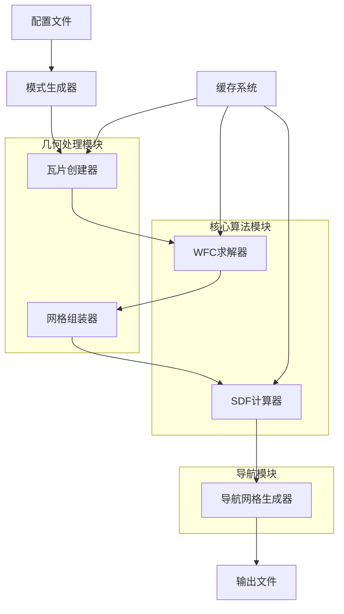
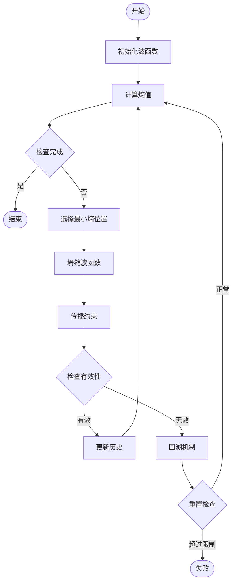
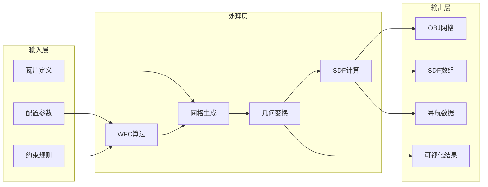
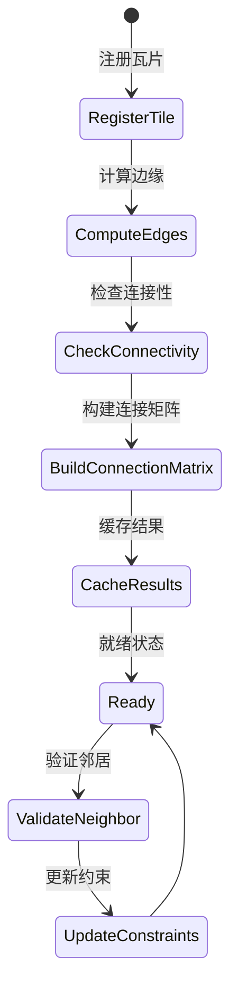

# Terrain Generator 地形生成器分析报告

## 项目概述

这是一个基于**波函数坍缩（Wave Function Collapse, WFC）算法**的自动化地形生成工具，主要用于生成复杂的3D地形网格。该项目由Takahiro Miki开发，应用于机器人导航研究，特别是机器人在狭窄空间中的行走学习。

### 核心技术特点
- **波函数坍缩算法**：基于量子力学的波函数坍缩原理，用于程序化内容生成
- **网格瓦片系统**：使用预定义的瓦片模块构建复杂地形
- **连接性约束**：确保相邻瓦片之间的几何和拓扑兼容性
- **多模式地形生成**：支持室内、室外、悬垂等多种地形类型

## 数据传输流程

### 1. 配置数据流
```
配置文件 (.py) → 配置对象 → 瓦片生成器 → 网格对象
```

**关键路径**：
- `examples/configs/` - 配置文件定义地形参数
- `terrain_generator/trimesh_tiles/mesh_parts/mesh_parts_cfg.py` - 配置数据结构
- `terrain_generator/trimesh_tiles/patterns/pattern_generator.py` - 模式生成器

### 2. WFC算法数据流
```
初始瓦片设置 → 波函数状态 → 连接性约束 → 熵计算 → 坍缩选择 → 约束传播 → 最终地形
```

**核心组件**：
- `terrain_generator/wfc/wfc.py:514-563` - WFCSolver主控制流
- `terrain_generator/wfc/wfc.py:44-199` - WFCCore算法实现

### 3. 网格处理数据流
```
瓦片配置 → 网格生成 → 几何变换 → 网格合并 → SDF计算 → 导航网格 → 最终输出
```

**处理管道**：
- `terrain_generator/trimesh_tiles/mesh_parts/create_tiles.py:90-111` - 网格模式创建
- `terrain_generator/utils/mesh_utils.py:22-34` - 网格合并
- `terrain_generator/navigation/mesh_terrain.py:50-206` - 地形处理

## 核心算法分析

### 1. 波函数坍缩（WFC）算法

#### 算法原理
WFC算法基于量子力学中的波函数坍缩概念，用于程序化生成符合局部约束的全局模式。

#### 核心实现（`terrain_generator/wfc/wfc.py`）

**初始化阶段**：
```python
# 地形_generator/wfc/wfc.py:126-131
def init_randomly(self):
    idx = np.random.randint(0, self.shape, self.dimensions)
    tile_id = np.random.randint(0, self.n_tiles)
    self._update_wave(idx, tile_id)
    self.new_idx = idx
```

**熵计算与坍缩**：
```python
# terrain_generator/wfc/wfc.py:168-176
entropy = np.sum(self.wave.valid, axis=0)
entropy[self.wave.is_collapsed] = self.n_tiles + 1
idx = self.collapse(entropy)
if entropy[tuple(idx)] == self.n_tiles + 1:
    break  # 完成坍缩
```

**约束传播**：
```python
# terrain_generator/wfc/wfc.py:109-114
def _update_validity(self, new_idx: np.ndarray, tile_id: int):
    neighbours, directions = self._get_neighbours(new_idx)
    possible_tiles = self._get_possible_tiles(tile_id, directions)
    non_possible_tiles = [np.setdiff1d(np.arange(self.n_tiles), pt) for pt in possible_tiles]
    for neighbor, tiles in zip(neighbours, non_possible_tiles):
        self.wave.valid[(tiles,) + tuple(neighbor)] = False
```

**回溯机制**：
```python
# terrain_generator/wfc/wfc.py:203-227
def _back_track(self):
    self.back_track_cnt += 1
    self.total_back_track_cnt += 1
    look_back = max(min(self.back_track_cnt // 10, len(self.history) - 2), 0)
    if self.total_back_track_cnt > self.max_backtracking:
        raise ValueError("Too many total backtracks.", self.total_back_track_cnt)
    # ... 回溯到历史状态
```

### 2. 连接性管理系统

#### Edge类（`terrain_generator/wfc/wfc.py:293-346`）
处理瓦片边缘连接定义和方向映射：

```python
class Edge(object):
    def __init__(self, dimension=2, edge_types: Dict[str, str] = {}):
        self.dimension = dimension
        if dimension == 2:
            self.directions = Direction2D()
        elif dimension == 3:
            self.directions = Direction3D()
```

#### ConnectionManager（`terrain_generator/wfc/wfc.py:348-508`）
管理瓦片之间的连接关系：

```python
def _compute_connection_dict(self):
    # 计算所有瓦片之间的连接性
    for edge_dir, edges in self.edges.items():
        opposite_edge_dir = tuple(-np.array(edge_dir))
        opposite = np.array(self.flipped_edges[opposite_edge_dir])
        connectivity = np.array(np.all((edges[:, None, :] == opposite[None, :, :]), axis=-1))
```

### 3. 网格生成算法

#### 基础几何体生成（`terrain_generator/trimesh_tiles/mesh_parts/basic_parts.py`）

**平台网格生成**：
```python
# 地形生成器/trimesh_tiles/mesh_parts/basic_parts.py:26-79
def create_platform_mesh(cfg: PlatformMeshPartsCfg):
    # 基于高度数组生成3D网格
    vertices = np.zeros((num_rows * num_cols, 3), dtype=np.float32)
    vertices[:, 0] = xx.flatten()
    vertices[:, 1] = yy.flatten()
    vertices[:, 2] = hf.flatten() * vertical_scale
```

#### SDF（符号距离函数）计算（`terrain_generator/utils/mesh_utils.py:299-326`）

```python
def compute_sdf(mesh: trimesh.Trimesh, dim=[2, 2, 2], resolution: float = 0.1):
    # 使用Open3D计算符号距离函数
    scene = o3d.t.geometry.RaycastingScene()
    _ = scene.add_triangles(mesh_o3d)
    sdf, _ = compute_signed_distance_and_closest_geometry(scene, query_points)
    return sdf
```

### 4. 导航网格算法

#### 距离场计算（`terrain_generator/navigation/mesh_terrain.py:284-421`）

```python
class NavDistance(object):
    def get_distance(self, point, goal_pos):
        # 基于预计算的距离矩阵进行路径规划
        goal_idx = (torch.round(goal_pos[:, 1]) * self.shape[0] + torch.round(goal_pos[:, 0])).long()
        distance_map = self.matrix[goal_idx, :].reshape(-1, self.shape[0], self.shape[1])
```

## 系统流程图

### 1. 整体系统架构



### 2. WFC算法流程



### 3. 数据处理管道



### 4. 瓦片连接性流程



## 关键特性

### 1. 程序化内容生成
- 基于约束的随机生成
- 保证全局一致性
- 支持多种地形类型

### 2. 高性能优化
- **并行处理**：使用Ray进行分布式瓦片生成
- **缓存机制**：避免重复计算连接性和网格
- **内存优化**：高效的数据结构存储

### 3. 可扩展性
- 模块化设计
- 可配置的瓦片类型
- 灵活的约束系统

### 4. 实用功能
- **SDF计算**：用于碰撞检测
- **导航网格**：支持路径规划
- **可视化工具**：便于调试和验证

## 应用场景

1. **机器人仿真**：生成复杂的测试环境
2. **游戏开发**：程序化地图生成
3. **建筑设计**：空间布局优化
4. **研究应用**：算法验证和测试

## 技术栈

- **核心语言**：Python 3.x
- **几何处理**：Trimesh, Open3D
- **数值计算**：NumPy, SciPy
- **并行计算**：Ray
- **可视化**：Matplotlib
- **机器学习**：PyTorch（用于SDF处理）

## 性能特点

- **时间复杂度**：O(n³) 主要由WFC算法的约束传播决定
- **空间复杂度**：O(n²) 存储波函数状态和连接矩阵
- **并行化程度**：支持分布式瓦片生成
- **缓存效率**：大幅减少重复计算开销

这个系统展现了现代程序化内容生成技术的先进性，通过量子力学启发的算法实现了高度复杂且一致的地形生成，为机器人导航和仿真环境提供了强大的工具支持。