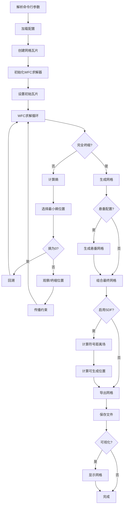

# 地形生成器分析报告

## 概述

本文档提供了对 `generate_with_wfc.py` 脚本的全面分析，该脚本使用波函数坍缩（WFC）算法实现了一个程序化地形生成系统。该系统能够生成具有各种建筑和导航元素的复杂3D网格地形。

## 代码结构与数据流

### 主要组件

1. **配置系统**：使用数据类定义地形模式和网格部件
2. **WFC求解器**：实现核心的波函数坍缩算法
3. **网格生成**：使用trimesh将瓦片模式转换为3D网格
4. **后处理**：可选的SDF生成和可生成位置计算

### 数据流架构

```
配置 → 模式生成 → WFC求解器 → 网格组合 → 导出
↓        ↓           ↓           ↓        ↓
网格部件  瓦片模式    波函数坍缩   3D网格   .obj/.npy
```

## 核心算法

### 1. 波函数坍缩（WFC）算法

**位置**：`terrain_generator/wfc/wfc.py:44-566`

WFC算法是一种受量子力学启发的约束满足算法：

#### 关键组件：
- **Wave类**：表示所有可能瓦片的叠加态
- **WFCCore**：实现带回溯的核心坍缩逻辑
- **ConnectionManager**：管理瓦片邻接约束

#### 算法步骤：
1. **初始化**：创建波网格，每个位置所有瓦片都可能
2. **熵计算**：找到具有最小不确定性的位置（最少有效瓦片）
3. **观察**：将一个位置坍缩到特定瓦片状态
4. **传播**：根据邻接规则更新相邻位置
5. **回溯**：如果出现矛盾，恢复到之前的状态

#### 伪代码：
```python
def wfc_solve():
    initialize_wave()
    while not fully_collapsed:
        entropy = calculate_entropy()
        min_entropy_pos = find_min_entropy(entropy)
        if entropy[min_entropy_pos] == 0:
            backtrack()
            continue
        observe(min_entropy_pos)
        propagate_constraints(min_entropy_pos)
    return wave
```

### 2. 网格模式生成

**位置**：`examples/configs/navigation_cfg.py:34-216`

系统通过配置定义多种地形模式：

#### 模式类型：
- **平台**：不同高度的平坦表面
- **楼梯**：递增的高度变化
- **坡道**：用于导航的倾斜表面
- **浮动盒子**：程序化障碍物
- **墙壁**：垂直边界

### 3. 基于瓦片的网格组合

**位置**：`examples/generate_with_wfc.py:101-183`

WFC网格中的每个瓦片对应一个预定义的网格组件：

#### 处理流程：
1. **瓦片查找**：通过瓦片ID检索网格组件
2. **变换**：根据网格位置应用平移
3. **组合**：将所有网格合并为单一地形
4. **居中**：将地形归一化到原点

## 数据结构

### 核心数据类型

#### Wave结构
```python
class Wave:
    wave: np.ndarray          # 最终瓦片分配
    valid: np.ndarray         # 每个瓦片的有效性掩码
    is_collapsed: np.ndarray  # 每个位置的坍缩状态
    wave_order: np.ndarray    # 坍缩顺序，用于可视化
```

#### 配置层次结构
```python
MeshPattern
├── dim: Tuple[float, float, float]     # 瓦片尺寸
├── mesh_parts: Tuple[MeshPartsCfg]     # 瓦片定义
└── seed: int                          # 随机种子
```

#### 瓦片边缘连接性
```python
edge_types: Dict[str, str] = {
    "up": "edge_type_up",
    "down": "edge_type_down",
    "left": "edge_type_left",
    "right": "edge_type_right"
}
```

## 流程图



## 关键函数分析

### `solve_with_wfc()` (第32-50行)

**目的**：协调整个WFC求解过程

**数据流**：
1. 输入：配置模式、网格形状、初始瓦片
2. 处理：创建瓦片 → 初始化求解器 → 运行WFC
3. 输出：瓦片字典、波数组、顺序数组、名称映射

**关键操作**：
- 带边缘连接性的瓦片注册
- 在网格中心放置初始瓦片
- 带回溯支持的波坍缩

### `create_mesh_from_cfg()` (第53-227行)

**目的**：主要的地形生成流水线

**数据流**：
1. 输入：配置、悬垂配置、输出参数
2. 处理：WFC求解 → 网格生成 → 可选SDF计算
3. 输出：OBJ文件、可选SDF和可生成位置

**关键操作**：
- 地形和悬垂的并行WFC求解
- 带进度条的渐进式网格组合
- 用于导航支持的SDF计算
- 文件导出和可选可视化

## 数据传输模式

### 1. 配置 → 瓦片
- **方法**：`create_mesh_pattern(cfg)`
- **数据**：MeshPartsCfg → MeshTile对象
- **格式**：以瓦片名称为键的字典

### 2. 瓦片 → WFC求解器
- **方法**：`wfc_solver.register_tile()`
- **数据**：边缘连接规则
- **格式**：每个方向的边缘类型元组

### 3. WFC → 网格生成
- **方法**：波数组查找
- **数据**：瓦片ID的2D网格
- **格式**：形状为(高度, 宽度)的NumPy数组

### 4. 网格组合 → 导出
- **方法**：Trimesh操作
- **数据**：3D顶点和面数据
- **格式**：OBJ文件和可选的NumPy数组

## 性能特征

### 复杂度分析
- **WFC算法**：O(n²)，其中n = 网格单元数
- **网格生成**：O(n)，其中n = 瓦片数量
- **SDF计算**：O(n³)，其中n = SDF分辨率

### 内存使用
- **波存储**：O(n × t)，其中t = 瓦片类型数
- **网格数据**：O(v + f)，其中v = 顶点数，f = 面数
- **SDF数组**：O(r³)，其中r = SDF分辨率

## 扩展点

### 1. 自定义瓦片类型
在`mesh_parts_cfg.py`中添加新的网格部件和相应的生成器

### 2. 附加约束
扩展`ConnectionManager`以支持新的邻接规则

### 3. 替代算法
用其他程序化生成方法替换WFC求解器

### 4. 导出格式
添加对其他3D文件格式的支持

## 依赖和生态系统

### 核心库
- **numpy**：数值计算和数组操作
- **trimesh**：3D网格处理和操作
- **alive_progress**：进度条可视化

### 内部模块
- **terrain_generator.wfc**：WFC算法实现
- **terrain_generator.trimesh_tiles**：网格生成工具
- **terrain_generator.utils**：辅助函数和SDF计算

## 使用示例

### 基础室内导航
```bash
python examples/generate_with_wfc.py --cfg indoor --enable_sdf
```

### 悬垂地形
```bash
python examples/generate_with_wfc.py --cfg overhanging --over_cfg --visualize
```

### 自定义配置
```bash
python examples/generate_with_wfc.py \
    --cfg overhanging_floor \
    --mesh_dir custom_terrain \
    --mesh_name my_terrain \
    --initial_tile_name platform
```

## 结论

该地形生成器展示了约束满足算法在程序化内容生成中的复杂应用。模块化架构允许灵活的地形类型，同时通过WFC算法的邻接约束保持空间关系的连贯性。

该系统成功地将抽象模式生成与具体3D网格输出连接起来，为创建具有不同复杂性和建筑风格的导航虚拟环境提供了坚实的基础。